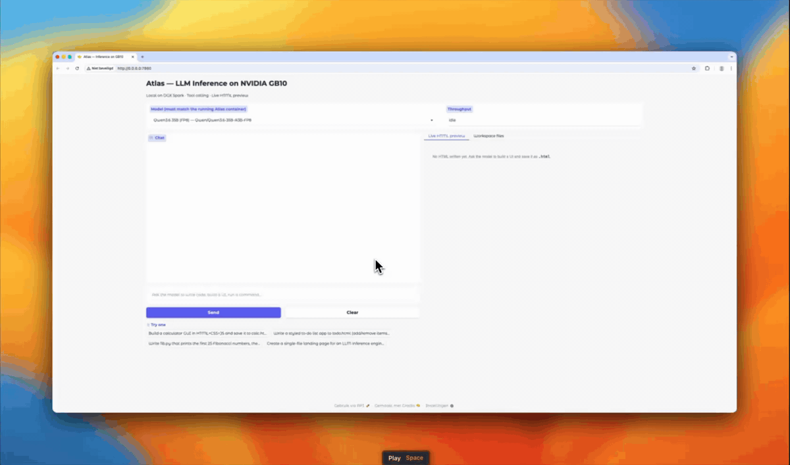

<p align="center">
  
</p>
<p align="center">
  <h1 align="center">Atlas Inference Engine</h1>
  <p align="center">
    <strong>Pure Rust & CUDA LLM Inference</strong><br>
    <em>Universal Inference At Unimaginable Speeds</em>
  </p>
  <p align="center">
    
    
    
  </p>
  <p align="center">
    <a href="LICENSE"></a>
    <a href="#quick-start"></a>
    <a href="https://hub.docker.com/r/azeezish/atlas-gb10:latest"></a>
    <a href="https://discord.com/invite/6vDbKaKrKD"></a>
    <a href="https://x.com/AtlasInference"></a>
  </p>
</p>

<p align="center">
  <a href="assets/atlas-demo.mp4"></a>
</p>

<p align="center">
  <a href="#quick-start"></a>
  <a href="https://atlasinference.dev"></a>
  <a href="https://mlcommons.org/2026/07/mlperf-inference-v61-edge-agentic/"></a>
  <a href="docs/GB10_DEPLOYMENT_GUIDE.md"></a>
</p>

---

## ⚡ What is Atlas?

Atlas is a high-performance, pure Rust & CUDA LLM inference engine purpose-built for prosumer workstations (NVIDIA DGX Spark / GB10 SM121 and AMD Strix Halo). No Python, no PyTorch, no bloated dependency trees—just one compact binary with hand-tuned micro-kernels.

- **Sub-90s First Token**: Boots in seconds with cached weights; zero JIT compile or Python startup lag.
- **Default Flagship Qwen 3.8 27B**: Dense hybrid GDN + Attention running at 23.59 tok/s single-stream with MTP speculative decoding on a single GB10.
- **Nemotron 3.5 Lightning + DSpark**: Full bring-up of hybrid Mamba-2 SSM + MoE paired with DSpark speculative decoding drafters for sub-10ms token decode latencies.
- **Qwen 3.8 Flash-Next Support**: Stream massive ~180B hybrid MoE models inside ~90 GB resident VRAM using direct parallel `pread` NVMe offloading.
- **Turnkey Sparkrun Integration**: Launch any verified model recipe instantly with `sparkrun run @atlas/<recipe>`.
- **OpenAI & Anthropic Compatible**: Drop-in API endpoint supporting streaming, tool calling, and reasoning traces.
- **MLPerf Proven**: Official contributor to the MLPerf Inference v6.1 Edge Agentic benchmark.

---

## Enntity releases

This fork publishes the Atlas engines used by
[SparkGLM](https://github.com/Enntity/sparkglm) and
[SparkQwen](https://github.com/Enntity/sparkqwen). The
[published release index](docs/PUBLISHED_RELEASES.md) records their exact
commits, source trees, upstream bases and measured scope.

The `enntity/releases` branch carries the released GLM source with updated
navigation. SparkQwen RC15 uses a different engine commit. Start from each
product's `install/atlas-source.json` to reproduce its measured build.
The Atlas project overview below is inherited from upstream.

---

<a id="philosophy"></a>

## 🧭 Philosophy

Atlas began as a solution to a widely known problem with Python inference engines. The code was steeped in an ever-shifting ecosystem of dependencies, patches, and cross-dependencies. One day your workaround for running a model works. The next, you are updating to a nightly branch of several dependencies and injecting a new workaround. That is how you build a proof of concept, not a software ecosystem. Data scientists proved LLMs can revolutionize our world. Now software engineers turn the proof of concept into something designed to withstand the test of time. The main objective mirrors what llama.cpp proved for cheap GPUs. As hardware advances, nobody should have to pay premium Cloud API prices for inference. Atlas maximizes speed for each hardware and model combination so a meaningfully powerful local model is truly useful.

- **Free and open source, always.** Great software comes from opening the source. The more eyes the better.
- **Community-first.** We build for you, and with source in hand you build for others in ways that triumph over existing solutions. We are the Pirates of the inference space.
- **Monorepo.** Everything in one place, so a data scientist, engineer, or agent can land a meaningful PR anywhere in the stack.
- **Hardware and model specific kernels.** No compromises or generalizations. Each combination gets fine-tuned custom kernels, which is where the 2-3x speedups come from.
- **AI-friendly codebase.** Built with enough railguards, structure, and abstraction for an AI to absorb the monorepo and contribute meaningfully. Fork it, point your agent at a model, and get a working port in hours instead of weeks. **AI-authored PRs are the default, and the target.** If you write code by hand, say which parts and why the human beat the AI. Every such case marks a gap in tooling we would rather close. The contribution loop lives in [`CONTRIBUTING.md`](CONTRIBUTING.md#pull-request-process).
- **Theory-friendly.** Relevant arXiv results are welcome as PoC PRs. Explain what you did and why.
- **Plug-and-play design.** Modular traits keep the business logic identical across hardware and model combinations. Only the concrete implementations differ. The extension points are `ModelWeightLoader`, `TransformerLayer`, `GpuBackend`, `CommBackend`, `StorageBackend`, and the `kernels/<hw>/<model>/<quant>/` directory convention.

<a id="models"></a>

## 📦 What We Ship Today

One multi-model binary. The right kernel set is selected at startup from the model's `config.json`, so there is no swapping images and no rebuilding. Point Atlas at a HuggingFace ID, or launch a verified recipe with `sparkrun run @atlas/<recipe>`. The recipe SSOT is [sparkrun-recipes](https://github.com/Atlas-Inf/sparkrun-recipes) and the interactive browser lives at [atlasinference.dev/#models](https://atlasinference.dev/#models).

Numbers are single-GB10 decode tok/s measured end-to-end through the HTTP API on a short prompt (`max_tokens ≤ 30`, `temperature = 0.1`), reproducible via `scripts/sweep_all_models.sh`.

| Model | HuggingFace ID | Params / active | Architecture | Recipe | tok/s |
|---|---|---|---:|---|---:|
| **Qwen3.8-27B flagship** | `nvidia/Qwen3.8-27B-NVFP4` | 27B dense | GDN + attention hybrid, MTP | `@atlas/qwen3.8-27b-nvfp4` | 23.59 |
| **Qwen3.8-Flash-Next** | `RadixArk/Qwen3.8-Flash-Next-NVFP4` | ~180B MoE | GDN + attention + MoE, PLE NVMe streaming | `@atlas/qwen3.8-flash-next-nvfp4` | 36.7 |
| Nemotron-3.5-Lightning + DSpark | `nvidia` checkpoint via recipe | 30B / 3B | Mamba-2 + attention + MoE + DSpark drafter | `@atlas/nemotron-3.5-lightning-30b-a3b-nvfp4-dspark` | sub-10ms/token |
| Qwen3.5-27B | `Kbenkhaled/Qwen3.5-27B-NVFP4` | 27B dense | Hybrid SSM + attention, dense FFN, MRoPE | | 13 |
| Qwen3.5-35B-A3B | `Sehyo/Qwen3.5-35B-A3B-NVFP4` | 35B / 3B | GDN + attention + MoE, MTP | | **131** (MTP K=2) |
| Qwen3.5-122B-A10B | `Sehyo/Qwen3.5-122B-A10B-NVFP4` | 122B / 10B | GDN + attention + MoE, MTP | | 46 (EP=2) |
| Qwen3.6-35B-A3B | `Qwen/Qwen3.6-35B-A3B-FP8` | 35B / 3B | GDN + attention + MoE, MRoPE, vision | `@atlas/qwen3.6-35b-a3b-fp8-mtp` | |
| Holo-3.1-35B-A3B | `Hcompany/Holo-3.1-35B-A3B-NVFP4` | 35B / 3B | GDN + attention + 256-expert MoE, Qwen3-VL vision | | |
| Holo-3.1-0.8B | `Hcompany/Holo-3.1-0.8B` | 0.8B dense | GDN + attention + dense FFN, Qwen3-VL vision | | |
| Ornith-1.0-9B | `deepreinforce-ai/Ornith-1.0-9B` | 9B dense | GDN + attention + dense FFN, Qwen3-VL vision, MRoPE | | |
| Qwen3-Next-80B-A3B | `nvidia/Qwen3-Next-80B-A3B-Instruct-NVFP4` | 80B / 3B | SSM + attention + MoE | | 74 |
| Qwen3-VL-30B-A3B | `ig1/Qwen3-VL-30B-A3B-Instruct-NVFP4` | 30B / 3B | Vision + attention + MoE | | 97 |
| Gemma-4-26B-A4B | `bg-digitalservices/Gemma-4-26B-A4B-it-NVFP4A16` | 26B / 4B | Attention + MoE, GeGLU | `@atlas/gemma-4-26b-a4b-nvfp4` | 67 |
| Gemma-4-31B | `nvidia/Gemma-4-31B-IT-NVFP4` | 31B dense | Attention (sliding + full), GeGLU | | 9 |
| Mistral-Small-4-119B | `mistralai/Mistral-Small-4-119B-2603-NVFP4` | 119B / 6.5B | Attention + MoE | | 33 |
| MiniMax-M2.7 | `lukealonso/MiniMax-M2.7-NVFP4` | 229B / ~10B | Attention + 256-expert MoE + MTP | | |
| Nemotron-3-Nano-30B-A3B | `nvidia/NVIDIA-Nemotron-3-Nano-30B-A3B-NVFP4` | 30B / 3B | Mamba-2 + attention + MoE | `@atlas/nemotron-3-nano-30b-a3b-nvfp4` | 88 |
| Nemotron-3-Super-120B-A12B | `nvidia/NVIDIA-Nemotron-3-Super-120B-A12B-NVFP4` | 120B / 12B | Mamba-2 + attention + MoE | `@atlas/nemotron-3-super-120b-a12b-nvfp4` | 24 |
| DeepSeek-V4-Flash | via recipe | | Attention + MoE | `@atlas/deepseek-v4-flash-nvfp4-ep2` | EP=2, 2 Sparks |

Flagship and Flash-Next also ship `-latency` and `-throughput` recipe variants for single-stream latency and 1 to 128 stream concurrency. On Qwen3.5-35B-A3B with MTP speculative decoding, Atlas decodes faster than NVIDIA's own vLLM build on the same hardware, on numbers we can hand you the script for. If you reproduce a faster vLLM number, file an issue. We would rather be measured than congratulated. The kernel-by-kernel comparison against PyTorch eager lives in the [benchmarks chapter](book/src/operations/benchmarks.md).

And this is only the beginning. The plug-and-play design has already carried AMD into the garden, Apple Silicon and Intel are next, and next quarter's models will slot in the same way the Qwens did this quarter.

> **New to Atlas on a Spark?** The [**GB10 Deployment & Compatibility Guide**](docs/GB10_DEPLOYMENT_GUIDE.md) is the one page to read first. It covers which model and quant fit your box, what to do when it OOMs, the known gotchas, and what verified means, then hands you the exact recipe.

<a id="performance"></a>

<a id="quick-start"></a>

## 🚀 Quick Start

### 1. NVIDIA GB10, flagship recipe `@atlas/qwen3.8-27b-nvfp4`

```bash
# Step 1, install sparkrun
pip install sparkrun  # or uvx sparkrun setup install

# Step 2, download weights (or let sparkrun fetch automatically)
huggingface-cli download unsloth/Qwen3.8-27B-NVFP4 \
  --local-dir ~/.cache/huggingface/hub/models--unsloth--Qwen3.8-27B-NVFP4

# Step 3, launch the flagship (port 8888)
sparkrun run @atlas/qwen3.8-27b-nvfp4 --hosts localhost
```

Prefer the one-line quickstart script?
```bash
curl -fsSL https://atlasinference.dev/quickstart.sh | sh
```

The other flagships work the same way. The recipe is the command.

```bash
# Nemotron 3.5 Lightning 30B + DSpark drafter, sub-10ms decode
export ATLAS_DFLASH_OPTION_B=1 ATLAS_NO_TOOL_INJECT=1
sparkrun run @atlas/nemotron-3.5-lightning-30b-a3b-nvfp4-dspark --hosts localhost

# Qwen 3.8 Flash-Next ~180B, streams the 47.7 GB PLE table off NVMe (~90 GB resident)
sparkrun run @atlas/qwen3.8-flash-next-nvfp4 --hosts localhost
```

### 2. AMD Strix Halo (gfx1151) on Linux and Windows

Strix Halo is a unified-memory APU, so the validated path is the native binary built against ROCm with no container. Both legs merged into main via [PR #8](https://github.com/Atlas-Inf/atlas/pull/8) (Linux) and [PR #9](https://github.com/Atlas-Inf/atlas/pull/9) (Windows).

**Linux** (Ubuntu 24.04, ROCm 6.2+)

```bash
git clone https://github.com/Atlas-Inf/atlas.git
cd atlas
./build-amd.sh                              # strix-hip backend, all targets, needs ROCm + cargo
./serve-amd.sh                              # nvidia/Qwen3.8-27B-NVFP4, validated config
./serve-amd.sh unsloth/Qwen3.8-27B-NVFP4    # or the preservation checkpoint
```

Defaults are the validated config. K=4 MTP speculative, the W4A8 DP4A decode arm, BF16 KV. `NUM_DRAFTS=0` disables speculation, `LM_HEAD=bf16` switches for the unsloth checkpoint's per-row-FP8 lm_head, and `ATLAS_W4A16_DP4A=0` opts out of DP4A. The `ATLAS_FP8_DEQUANT_*` and `ATLAS_GDN_BF16_WEIGHTS` exports are baked in and required for unsloth.

Measured on a Ryzen AI Max+ 395 with Radeon 8060S under ROCm 7.13 at ~60 GB GTT. **28.3 to 28.6 tok/s** K=4 decode, 13.3 to 13.6 tok/s at 30k context, and **83.02 / 80.41** on the 995-row bfcl-subset golden draw, matching the NVIDIA shipped reference (83.22 / 79.02). Details in [`BENCH.toml`](kernels/strix-hip/qwen3.8-27b/BENCH.toml) and [`amd-strix-halo-scale.md`](docs/porting/amd-strix-halo-scale.md).

**Windows** (native HIP on Windows 11, no WSL, no container. `spark.exe` is MSVC-built and reaches the GPU through a CUDA to HIP shim over ROCm 10 / TheRock)

```powershell
git clone https://github.com/Atlas-Inf/atlas.git
cd atlas

hf download nvidia/Qwen3.8-27B-NVFP4 `
  --local-dir "$env:USERPROFILE\models\nvidia-Qwen3.8-27B-NVFP4"

# Build from PowerShell, not Git Bash (bash puts coreutils link.exe ahead
# of MSVC's). Needs MSVC Desktop C++, the ROCm SDK (HIP_PATH), and cargo.
.\build-amd.ps1

# Serve, the fingerprinted fp8d recipe. Native FP8 GDN, K=4 MTP, BF16 KV
# and lm_head. Preflight hard-fails on non-gfx1151 GPUs.
.\serve-amd.ps1
```

Prebuilt instead? Unzip `spark-windows-x86_64-amd-hip` keeping every DLL beside `spark.exe`, set `$env:ATLAS_BIN` to it, and run `.\serve-amd.ps1`. That skips the toolchain check and the build. The script runs a detached smoke probe (`first_run_smoke.log`), and the 64K-context record config is [`win_serve_qwen38_nvfp4.ps1`](scripts/strix-windows/win_serve_qwen38_nvfp4.ps1).

Measured on a Framework Desktop (Ryzen AI Max+ 395, Radeon 8060S, Windows 11, ROCm 10.0.0 TheRock, Adrenalin 32.0.31041.1004). **83.32 / 78.70** on the bfcl-subset golden draw with zero faults in 3.6 hours, and **17.25 tok/s** decode with MTP engaged at p1 0.834. Provenance in [`BENCH.toml`](kernels/strix-hip/qwen3.8-27b/BENCH.toml) and [`STRIX_WINDOWS_HIP.md`](docs/porting/STRIX_WINDOWS_HIP.md).

### Hitting the Endpoint

Atlas speaks OpenAI, Anthropic, and Responses APIs on the same port. `curl`, the OpenAI SDK, Open WebUI, opencode, Cline, and Claude Code all work when pointed at the served port. `sparkrun` recipes default to 8888 and the AMD scripts default to 8081.

```bash
curl http://localhost:8888/v1/chat/completions \
  -H "Content-Type: application/json" \
  -d '{
    "model": "atlas",
    "messages": [{"role": "user", "content": "Explain quantum computing in three sentences."}],
    "max_tokens": 256
  }'
```

---

## 🤝 Community & Support

- **Website**: [atlasinference.dev](https://atlasinference.dev)
- **Discord**: [Join our Discord](https://discord.com/invite/6vDbKaKrKD) — Active daily development, live kernel tuning, and model requests.
- **Recipes Repository**: [Atlas-Inf/sparkrun-recipes](https://github.com/Atlas-Inf/sparkrun-recipes)
- **Deployment Guide**: [GB10 Deployment Guide](docs/GB10_DEPLOYMENT_GUIDE.md)

---

## ⚖️ Dual License

- **Community Edition**: Licensed under **AGPLv3**. Free and open for personal use, research, and non-commercial local deployments.
- **Enterprise Edition**: Commercial licensing for proprietary applications, SaaS hosting without AGPLv3 copyleft obligations, dedicated support, and custom hardware/kernel porting. Contact `debaterishaqui@gmail.com`.

<sub><b>Continuity notice.</b> Atlas is continuing. This repository, the <a href="https://github.com/Atlas-Inf">Atlas-Inf</a> GitHub organization, and <a href="https://atlasinference.dev">atlasinference.dev</a> are the replacement official Atlas channels. The existing website and GitHub repository remain disputed Atlas assets that have not been relinquished.</sub>
